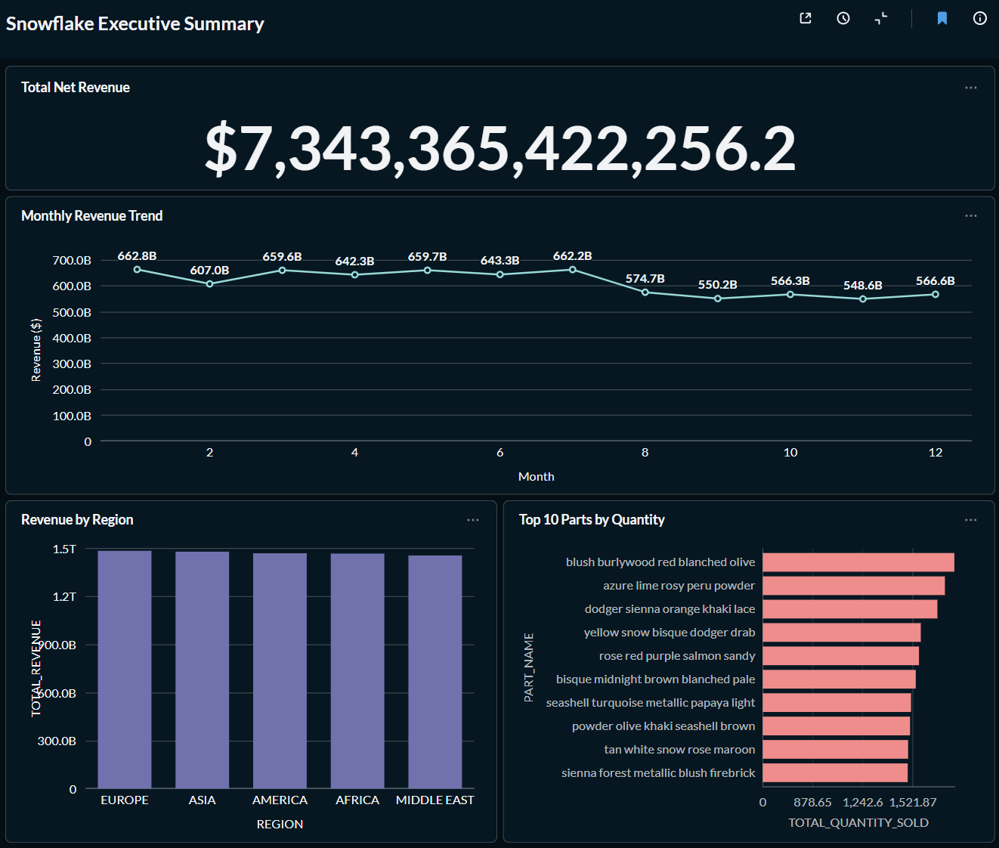

# Modern Data Stack: TPC-H Pipeline & Analytics

This repository contains an end-to-end ELT pipeline and Business Intelligence (BI) suite built on the **Snowflake TPC-H** dataset. 
The project demonstrates professional data engineering workflows including modular **dbt** modeling, **Star Schema** architecture, 
containerized deployment using **Docker** and delivered business insights through an Executive Dashboard in **Metabase**.

---

## Technical Architecture

The pipeline follows a modern ELT architecture where all transformations are executed within the Snowflake cloud data warehouse.

| Layer | Technology        | Purpose |
| :--- |:------------------| :--- |
| **Data Warehouse** | **Snowflake**     | Storage and compute for the raw and transformed data. |
| **Transformation** | **dbt-snowflake** | Modular SQL modeling, testing, and documentation. |
| **Database Ops** | **PostgreSQL**    | Persistent state management for Metabase metadata. |
| **Visualization** | **Metabase**      | Interactive Business Intelligence and Executive Dashboarding. |
| **Infrastructure** | **Docker**        | Containerization of the local analytics environment. |

---

## Executive Sales Dashboard

> **Insight:** The dashboard provides a high-level view of **$7.3T** in total revenue, allowing stakeholders to drill down into regional performance, monthly trends, and product-level quantity metrics.

---

## Data Modeling Strategy

### **The Star Schema**
To optimize for analytical performance and end-user accessibility, the data was modeled into a classic **Kimball Star Schema**.

* **Fact Table:** `fct_order_items` — Modeled at the **Line Item Grain**. This central table contains quantitative measures (Quantity, Revenue) and links to all descriptive dimensions.
* **Dimension Tables:** 
    * `dim_customers`: Denormalized customer data including geographic Region and Nation.
    * `dim_parts`: Detailed part characteristics.
    * `dim_suppliers`: Supplier metadata and geographic location.

### **dbt Modeling Layers**
1.  **Staging (`models/staging/`):** 1:1 mapping to raw Snowflake tables. Handles columns renaming.
2.  **Marts (`models/marts/`):** The "Gold" layer. Implements business logic (Net Revenue calculations), handles complex joins, and enforces referential integrity.
3.  **Testing:** Implemented unique, not_null, and relationship (Foreign Key) tests to ensure data quality before it reaches the BI layer.

---

## Infrastructure & Containerization

To ensure a robust and isolated environment, I containerized the analytics layer:

- **Metabase** for visualization.

- **PostgreSQL** as a persistent backend for Metabase to store dashboard definitions and metadata, preventing data loss on container restart.

- **Docker Networking** to facilitate secure, private communication between the services.

## How to Run
**Prerequisites**
- Snowflake Account (with TPCH_SF1 sample data access).
- Docker Desktop installed.
- dbt-snowflake installed locally.

**Setup Instructions**
1. **Clone the Repository**
```bash
git clone https://github.com/Chanpitou/Modern-Data-Stack-TPCH-Pipeline
cd Modern_Data_Stack_TPCH_Pipeline
```
2. **Environment Variables:**
Create a .env file in the root directory to store your Postgres credentials:
```bash
MB_POSTGRES_PASSWORD=your_secure_password
```
3. **Spin up the Metabase (BI Layer):**
```bash
docker-compose up -d
```
4. **Initialize dbt**
```bash
dbt deps
dbt build
```
5. **Access the Dashboard**
- Open your browser to http://localhost:3000.
- Complete the Metabase setup and connect to your Snowflake marts schema.
- Recreate the Executive Summary questions using the Star Schema tables.